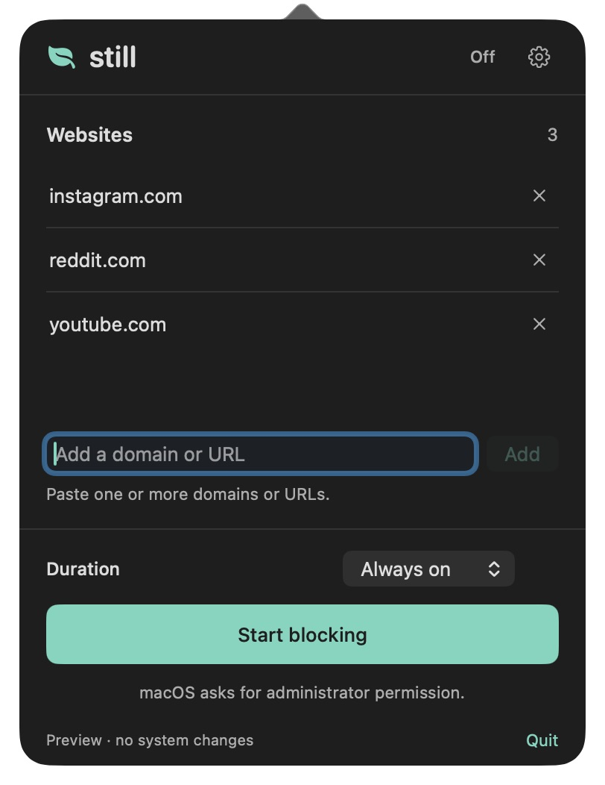

# Still

A native macOS menu bar website blocker by viciousbuilders. Choose a short focus session or keep your blocklist always on, and turn it off whenever you want.

[Still](https://viciousbuilders.com/still) · [Source code](https://github.com/viciousbuilders/still)



## Build and open

Requires macOS 13+ and Xcode Command Line Tools. No dependencies or accounts.

```sh
git clone https://github.com/viciousbuilders/still.git
cd still
./scripts/build.sh
open dist/Still.app
```

Click the shield in the menu bar, add website domains or paste URLs separated by commas/spaces, choose **Always on** or a session length under **Duration**, and click **Start blocking**. macOS asks for an administrator password when a block changes. **Stop blocking** is always available; there is no locked mode. List edits during a block take effect only after **Apply changes**.

Use the gear button for **Open Still at login** and details about blocking. For a stable login-item path, copy `dist/Still.app` into `/Applications` before enabling it. The build script produces a locally ad-hoc-signed app for the current Mac architecture; it is not a notarized distribution release.

An interactive preview lets you try the controls without changing your hosts file, installing the helper, saving preferences, or enabling a login item:

```sh
open dist/Still.app --args --demo
```

Quit an existing instance before switching between normal and preview mode.

To check the actual menu bar popover instead of the standalone preview window:

```sh
open dist/Still.app --args --demo --menu-preview
```

Preview mode also accepts `--light` and `--dark` to check both appearances without changing system settings.

## Blocking behavior

- Blocks listed domains and their `www` versions using IPv4 and IPv6 entries in `/private/etc/hosts`.
- Preserves existing hosts-file entries, including entries added by other tools while a block is active. Only the section between `# BEGIN STILL WEBSITE BLOCKER` and `# END STILL WEBSITE BLOCKER` belongs to Still.
- Always-on blocks persist through app quits, logouts, and restarts. Ending them requires **Stop blocking**, not just quitting or deleting the app.
- Timed sessions use a root-owned LaunchDaemon with an absolute expiry time. The job checks every 15 seconds and clears the block even if Still is closed. A sleeping Mac clears an expired block after waking. The timer job unloads itself after expiry; always-on mode needs no background job.
- Administrator cancellation leaves the current block unchanged. Website input is validated again by the helper before any privileged writes.
- No browsing-history collection, analytics, cloud services, installed-app blocking, or network requests from Still.

Hosts-file blocking is a lightweight deterrent. Browser Secure DNS / DNS-over-HTTPS, VPNs, proxies, direct IP access, and existing browser connections may bypass it. Restart the browser if a previously loaded site still opens. Disable browser Secure DNS if the browser ignores the system resolver. This version does not install a firewall, VPN, or browser extension. It does not promise SelfControl’s resistance to tampering.

Hosts files do not support wildcard domains. Add `old.reddit.com` separately from `reddit.com`, for example. Paths in pasted URLs are removed: blocking a URL blocks its whole domain, not just that page. International domains must be entered in ASCII / punycode form. Internal hostnames, IP addresses, and wildcards are rejected.

## Recovery and uninstall

First turn off blocking in Still. If the app is unavailable, the installed helper can remove its block:

```sh
sudo "/Library/Application Support/Still/StillHelper" --remove
```

If the installed helper is missing, rebuild and use the bundled helper:

```sh
sudo "dist/Still.app/Contents/Helpers/StillHelper" --remove
```

If someone manually damaged Still’s markers, the helper refuses to guess which unrelated lines to delete. Use `sudo nano /private/etc/hosts` to remove only Still’s section and its domain entries, preserving the host database and other tools’ rules. Then run `--remove` again to clear the saved state and scheduled job. An initial reference backup is in `/Library/Application Support/Still/hosts-before-still`; do not restore the whole backup over newer entries from other tools.

To uninstall completely: turn off the login toggle, turn off blocking, quit Still, delete its app bundle, and remove its root-owned support directory:

```sh
sudo rm -r "/Library/Application Support/Still"
```

Never delete the helper while a timed block is still active. Merely deleting the app leaves the hosts-file rules in place.

## Development and verification

```sh
swift test
./scripts/build.sh
codesign --verify --deep --strict dist/Still.app
```

Tests use temporary hosts files and support directories. They cover normalization, malicious input, malformed markers, existing custom rules, updates, rollback, symlink refusal, persisted absolute timers, and expiry without the UI. They do not alter the real hosts file or launch a system daemon. The administrator prompt and real root launchd lifecycle need an on-device acceptance check before release.

`BlockerCore` holds domain validation and hosts-file transformations. `BlockerSystem` owns transactional writes and expiry scheduling. `StillHelper` exposes a narrow root-only command interface. `Still` is the SwiftUI menu bar UI and runs the helper through macOS’s standard administrator prompt. The app reads the actual hosts section and helper state rather than assuming a saved UI preference means a block is active.

Inspired by [SelfControl](https://github.com/SelfControlApp/selfcontrol/) and the menu bar utility feel of [Pipet](https://github.com/viciousbuilders/pipet). This is an independent implementation; no SelfControl source code was copied.

## License

MIT. See [LICENSE](LICENSE).
